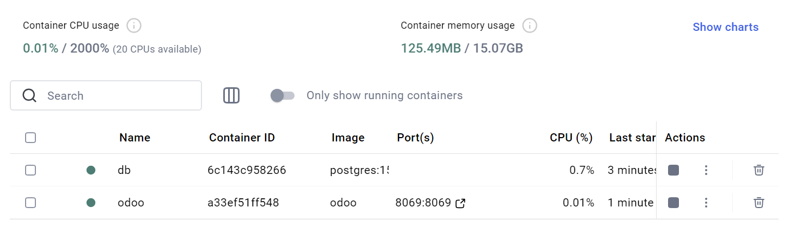
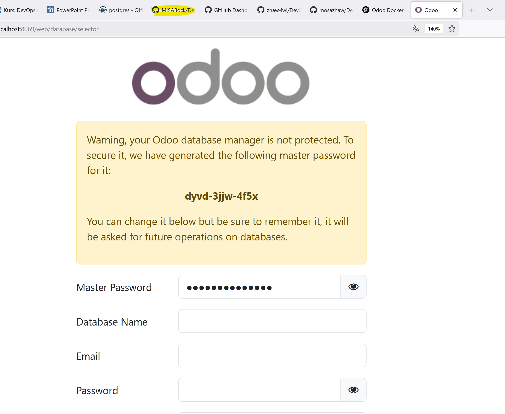
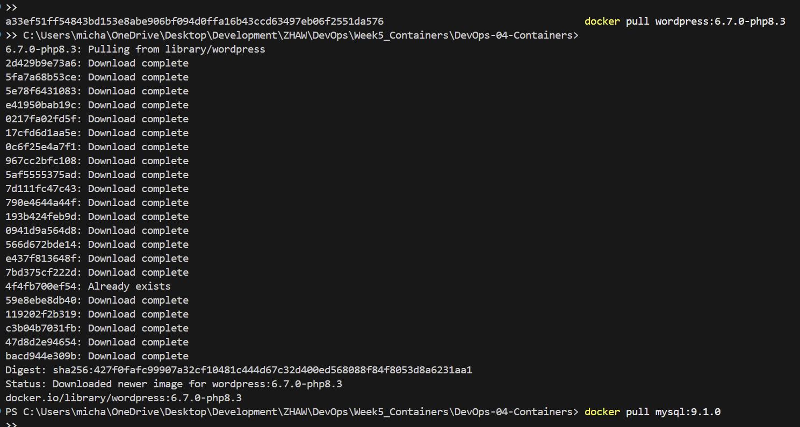
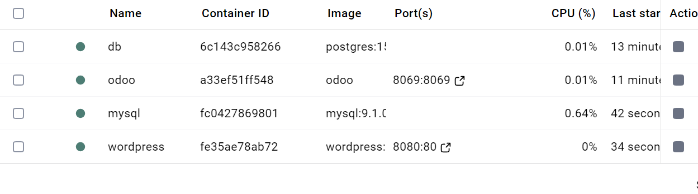
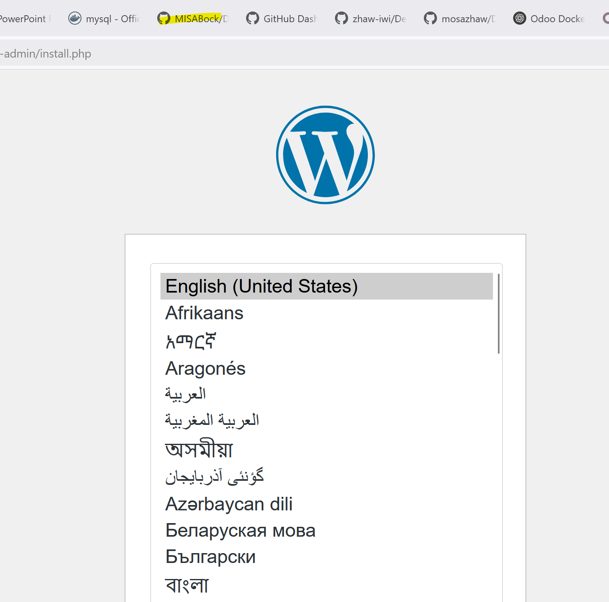
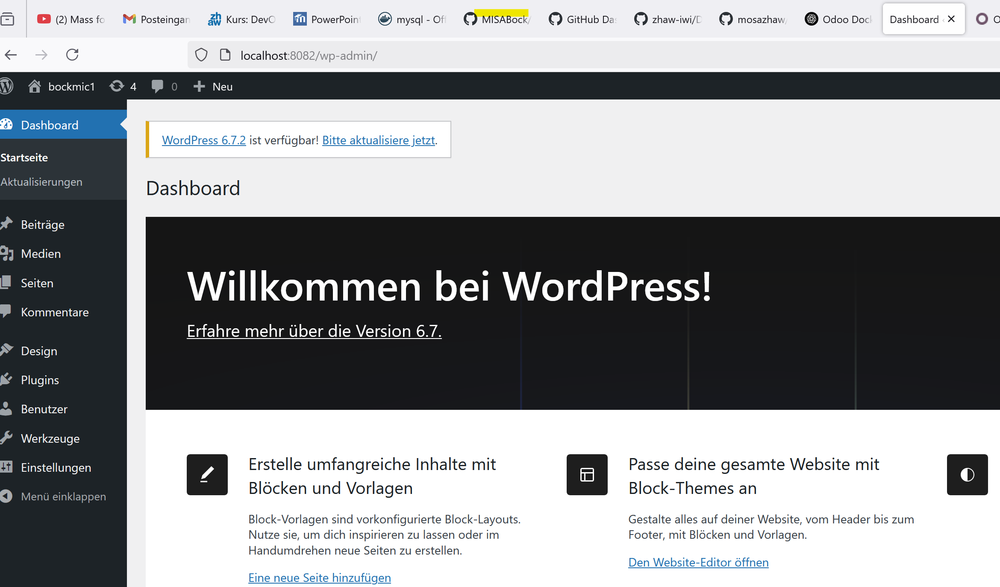
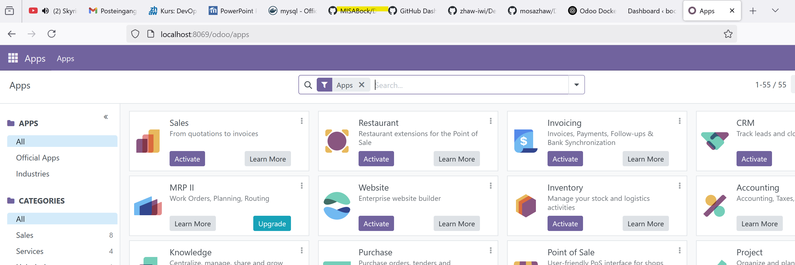
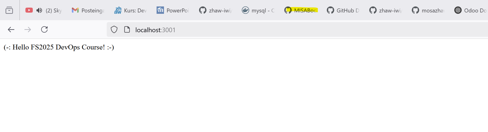
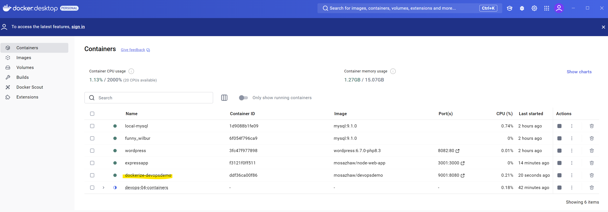
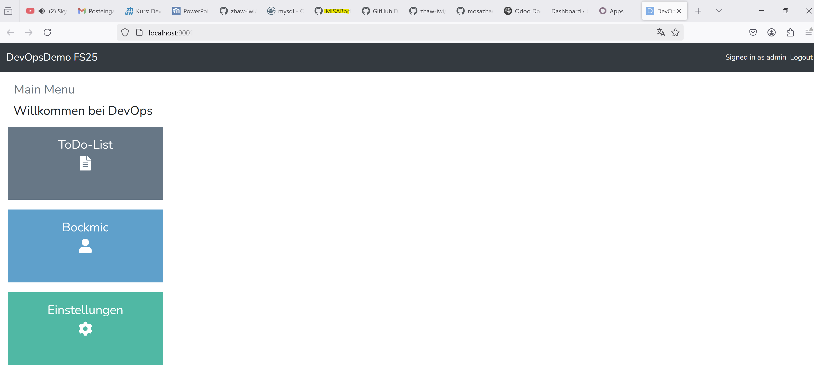

# DevOps 04 Containers

### Verwendete Images

| Docker Hub URL | Kurzbeschreibung
| ------- | ------- |
| https://hub.docker.com/_/odoo/ | Ich habe das Odoo images gepulled|
| https://hub.docker.com/_/postgres | Image von Postgres für die DB |
| https://hub.docker.com/_/wordpress | Image von wordpress |
| https://hub.docker.com/_/mysql | Image von mysql |
| 

Für jedes Image eine Zeile in der Tabelle verwenden.

ich habe nun als erstes die Postgres-DB gestaret und danach Odoo. ()

auf folgendem Bild sieht man wie Odoo auf dem Localhost läuft. ()

Desweiteren habe ich wie auf den PPT-Folien beschrieben mysql und wordpress images heruntergeladen. ()

Desweiteren habe ich beide Container gestartet und wordpress auf Localhost 8080 laufen gelassen. () ()

ich habe dann die Einstellung gemacht und mich auf Wordpress angemeldet: ()

Ich habe ein docker-Compose-yaml für Postgres und Odoo erstellt. Siehe Repo. damit konnte ich auch die beiden Container starten und Odoo im localhost öffnen.()

Desweiteren Habe ich folgendes Repo gecloned: https://github.com/zhaw-iwi/DevOpsNodeWebApp und das Dockerfile zusammenbauen lassen. ()

ich habe dannach noch meine eigene Applikation in einen Container gepackt und es dann auf dem Localhost9001 laufen gelassen.  () ()

WordPressRunning
### Compose-File

[Link zu Docker Compose File in diesem Repository](README.md)

## Eigenes Lernjournal